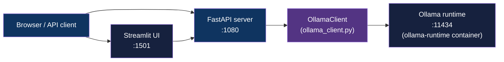
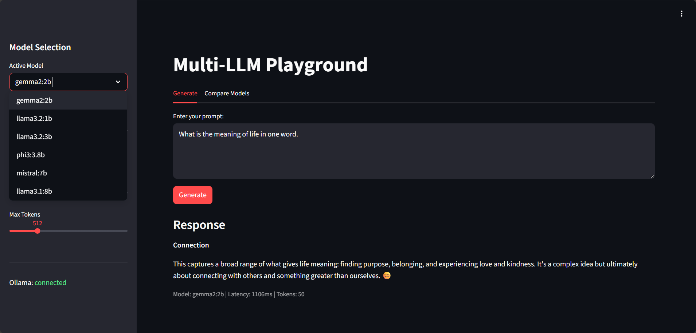
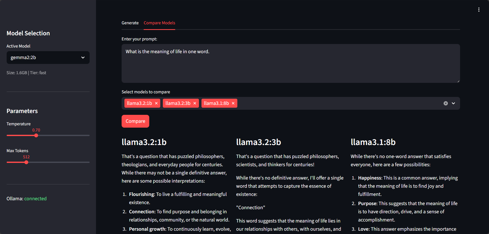

<div align="center">

# Ollama Multi-LLM Server

[](https://www.python.org/downloads/)
[](https://fastapi.tiangolo.com/)
[](LICENSE)

**Multi-model inference API and Streamlit playground over 3 local Ollama LLMs - serve, switch, compare, benchmark**

[Getting Started](#getting-started) | [Usage](#usage) | [Architecture](#architecture)

</div>

---

## Table of Contents

- [Features](#features)
- [Tech Stack](#tech-stack)
- [Architecture](#architecture)
- [Demo](#demo)
- [Getting Started](#getting-started)
  - [Prerequisites](#prerequisites)
  - [Installation](#installation)
- [Usage](#usage)
- [API Reference](#api-reference)
- [Architectural Decisions](#architectural-decisions)
- [Project Structure](#project-structure)
- [Testing](#testing)
- [Deployment](#deployment)
- [Related Projects](#related-projects)
- [License](#license)
- [Author](#author)

## Features

- **Multi-model switching** - hot-swap between llama3.2:3b, qwen2.5:3b, and phi3.5:3.8b via REST API
- **Side-by-side comparison** - send one prompt to multiple models concurrently and inspect latency + token count per response
- **Tiered model selection** - fast / balanced / quality tiers for different inference workloads
- **Performance benchmarking** - `scripts/benchmark.py` runs throughput comparisons across all registered models and optionally saves JSON results
- **Streamlit playground** - interactive UI for generate and compare workflows on port 1501
- **Live Ollama status** - sidebar health indicator backed by `/health` endpoint polling

## Tech Stack

| Component | Technology |
|-----------|------------|
| Language | Python 3.12+ |
| API framework | FastAPI 0.100+ |
| UI | Streamlit |
| HTTP client | httpx (async) |
| LLM runtime | Ollama |
| Infrastructure | Docker Compose |

## Architecture



The API and UI run as separate Docker services sharing the `ollama-runtime-network` external bridge network. `OllamaClient` is a module-level singleton that wraps Ollama's `/api/generate` and `/api/tags` endpoints with async httpx calls and tracks the active model in memory.

## Demo

| Mode | Screenshot |
|------|------------|
| Multi-LLM Playground |  |
| Model Comparison |  |

## Getting Started

### Prerequisites

- Docker and Docker Compose
- NVIDIA GPU + drivers (optional; CPU fallback works)
- [ollama-runtime](https://github.com/adityonugrohoid/ollama-runtime) running on the `ollama-runtime-network` bridge

### Installation

1. Clone the repository:
   ```bash
   git clone https://github.com/adityonugrohoid/ollama-multi-llm-server.git
   cd ollama-multi-llm-server
   ```

2. Start the Ollama runtime container (see [ollama-runtime](https://github.com/adityonugrohoid/ollama-runtime)):
   ```bash
   cd ~/projects/ollama-runtime && ./scripts/start.sh
   ```

3. Pull the LLMs into Ollama:
   ```bash
   ./scripts/pull_models.sh
   ```

4. Start the API and UI:
   ```bash
   ./scripts/start.sh
   ```

Service URLs after startup:

| Service | URL |
|---------|-----|
| API | http://localhost:1080 |
| API Docs (Swagger) | http://localhost:1080/docs |
| Playground UI | http://localhost:1501 |

## Usage

Generate a response from the default model:

```bash
curl -X POST http://localhost:1080/inference/generate \
  -H "Content-Type: application/json" \
  -d '{"prompt": "Explain Docker in one sentence", "max_tokens": 128}'
```

Compare two models on the same prompt:

```bash
curl -X POST "http://localhost:1080/inference/compare?prompt=What+is+RAG&models=llama3.2:3b&models=qwen2.5:3b"
```

Benchmark all models and save results:

```bash
python3 scripts/benchmark.py --output results.json
```

## API Reference

### Endpoints

| Method | Endpoint | Description |
|--------|----------|-------------|
| `GET` | `/models/` | List all registered models and current selection |
| `GET` | `/models/current` | Get the currently active model |
| `POST` | `/models/switch` | Switch the active model |
| `POST` | `/inference/generate` | Generate text from the current or a specified model |
| `POST` | `/inference/compare` | Compare responses from multiple models side-by-side |
| `GET` | `/health` | Ollama connectivity check |

### Switch model

```bash
curl -X POST http://localhost:1080/models/switch \
  -H "Content-Type: application/json" \
  -d '{"model_id": "qwen2.5:3b"}'
```

### Generate response

```bash
curl -X POST http://localhost:1080/inference/generate \
  -H "Content-Type: application/json" \
  -d '{"prompt": "What is quantization?", "temperature": 0.7, "max_tokens": 256}'
```

Response shape:

```json
{
  "response": "...",
  "model": "qwen2.5:3b",
  "latency_ms": 1240,
  "tokens_generated": 87
}
```

See [docs/API.md](docs/API.md) for the full endpoint specification.

## Architectural Decisions

### 1. Shared external Docker network for Ollama

**Decision:** The compose file attaches to `ollama-runtime-network` as an external bridge rather than spinning up a new Ollama instance per project.

**Reasoning:** Ollama holds model weights (1.9-2.2 GB each) in GPU VRAM. Sharing one runtime across sibling projects avoids duplicate VRAM consumption and removes model-pull overhead from each service's startup sequence.

### 2. Split requirements files

**Decision:** Three separate requirements files: `requirements.txt` (shared), `requirements-api.txt` (FastAPI layer), `requirements-ui.txt` (Streamlit layer).

**Reasoning:** Each Docker service installs only what it needs. The API image stays ~30% smaller than a combined install and avoids Streamlit's heavy frontend dependencies in a production inference container.

### 3. Async httpx for Ollama calls

**Decision:** `OllamaClient` uses `httpx.AsyncClient` per call rather than a persistent connection pool.

**Reasoning:** Ollama inference requests are long-lived (120 s timeout) and low-frequency. A per-call client avoids stale connection issues with the external network bridge without the overhead of managing a pool for an already-single-threaded Ollama backend.

## Project Structure

```
ollama-multi-llm-server/
├── api/
│   ├── Dockerfile
│   ├── main.py                    # FastAPI app, router registration
│   ├── routes/
│   │   ├── inference.py           # POST /inference/generate, /inference/compare
│   │   ├── models.py              # GET/POST /models/
│   │   └── health.py              # GET /health
│   └── clients/
│       └── ollama_client.py       # Async Ollama HTTP wrapper + model registry
├── ui/
│   └── app.py                     # Streamlit playground (Generate + Compare tabs)
├── scripts/
│   ├── start.sh                   # Launch API + UI containers
│   ├── pull_models.sh             # Pull all 3 models into Ollama
│   └── benchmark.py              # Throughput comparison across models
├── tests/
│   ├── conftest.py
│   └── test_inference.py          # 4 endpoint tests (11 assertions)
├── docs/
│   ├── images/                    # UI screenshots
│   ├── API.md                     # Full endpoint specification
│   └── MODELS.md                  # Model catalog
├── docker-compose.yaml
├── requirements.txt
├── requirements-api.txt
├── requirements-ui.txt
├── pytest.ini
└── LICENSE
```

## Testing

```bash
# Install dependencies
python -m venv .venv
source .venv/bin/activate
pip install -r requirements.txt

# Run all tests
python -m pytest tests/ -v
```

The test suite covers list models, get current model, generate, and health endpoints using `AsyncMock` patches against the Ollama client.

## Deployment

### Docker Compose (recommended)

```bash
# Start API + UI (requires Ollama runtime on ollama-runtime-network)
./scripts/start.sh

# Stop services
./scripts/stop.sh

# Restart
./scripts/restart.sh
```

### Manual (development)

```bash
# API
cd api && pip install -r ../requirements-api.txt
uvicorn main:app --host 0.0.0.0 --port 8080

# UI (separate terminal)
cd ui && pip install -r ../requirements-ui.txt
streamlit run app.py --server.port 8501
```

## Related Projects

| Project | Description |
|---------|-------------|
| [ollama-runtime](https://github.com/adityonugrohoid/ollama-runtime) | GPU-accelerated Ollama runtime container with shared Docker bridge network for multi-app local LLM serving |
| [rag-operator-console](https://github.com/adityonugrohoid/rag-operator-console) | RAG pipeline with operator console for prompt assembly visibility and debugging |

## License

This project is licensed under the [MIT License](LICENSE).

## Author

**Adityo Nugroho** ([@adityonugrohoid](https://github.com/adityonugrohoid))
