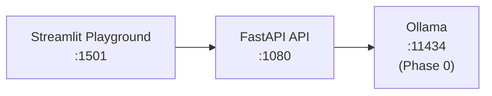

# Ollama Multi-LLM Server

Multi-model inference API and playground powered by [Ollama](https://ollama.com). Serve, switch, compare, and benchmark 6 local LLMs through a unified FastAPI backend and Streamlit UI.

**Part of the [GenAI Portfolio Suite](https://github.com/adityonugrohoid) - Phase 1: Local LLM Serving.**

## Playground UI

**Generate** - Select any model from the dropdown, tune temperature and max tokens, and get responses with latency and token count metadata.


**Compare Models** - Send the same prompt to multiple models side-by-side. Responses are displayed in columns for direct quality and speed comparison.


**Highlights:**
- **Model switcher** - dropdown with all 6 models (gemma2:2b through llama3.1:8b)
- **Parameter controls** - temperature (0.0-2.0) and max tokens (64-2048) sliders
- **Response metadata** - model name, latency in ms, and token count on every response
- **Multi-model comparison** - select 2+ models and compare outputs in parallel
- **Ollama status** - live connection indicator in the sidebar

## Features

- **Multi-model switching** - hot-swap between 6 models via API
- **Model comparison** - send the same prompt to multiple models side-by-side
- **Tiered model selection** - fast / balanced / quality tiers for different use cases
- **Performance benchmarking** - automated speed and throughput comparison
- **Interactive playground** - Streamlit UI for experimentation

## Architecture



Ollama runs as a shared service from [Phase 0: ollama-runtime](https://github.com/adityonugrohoid/ollama-runtime). All phases connect via the `ollama-runtime-network` Docker network.

## Available Models

| Model | Size | Tier | Use Case |
|-------|------|------|----------|
| `gemma2:2b` | 1.6 GB | Fast | Quick responses, simple queries |
| `llama3.2:1b` | 1.3 GB | Fast | Ultra-fast, edge deployment |
| `llama3.2:3b` | 2.0 GB | Balanced | General local inference (default) |
| `phi3:3.8b` | 2.2 GB | Balanced | Reasoning, code tasks |
| `mistral:7b` | 4.4 GB | Quality | Instruction-following |
| `llama3.1:8b` | 4.9 GB | Quality | Best quality, complex tasks |

## Quick Start

### Prerequisites

- Docker and Docker Compose
- NVIDIA GPU + drivers (optional; CPU fallback works)
- [Phase 0: ollama-runtime](https://github.com/adityonugrohoid/ollama-runtime) running

### Start Services

```bash
# 1. Start Ollama (Phase 0)
cd ~/projects/ollama-runtime && ./scripts/start.sh

# 2. Start API + UI
cd ~/projects/ollama-multi-llm-server
./scripts/start.sh

# 3. Download models into Ollama
./scripts/pull_models.sh
```

### Service URLs

| Service | URL |
|---------|-----|
| API | http://localhost:1080 |
| API Docs (Swagger) | http://localhost:1080/docs |
| Playground UI | http://localhost:1501 |
| Ollama | http://localhost:11434 (Phase 0) |

## API Reference

### Models

```bash
# List all models
curl http://localhost:1080/models/

# Get current model
curl http://localhost:1080/models/current

# Switch model
curl -X POST http://localhost:1080/models/switch \
  -H "Content-Type: application/json" \
  -d '{"model_id": "mistral:7b"}'
```

### Inference

```bash
# Generate
curl -X POST http://localhost:1080/inference/generate \
  -H "Content-Type: application/json" \
  -d '{"prompt": "Explain Docker in one sentence", "max_tokens": 128}'

# Compare models
curl -X POST "http://localhost:1080/inference/compare?prompt=What+is+RAG&models=llama3.2:3b&models=mistral:7b"
```

### Health

```bash
curl http://localhost:1080/health
```

See [docs/API.md](docs/API.md) for the full API reference.

## Benchmarking

```bash
# Benchmark all models
python3 scripts/benchmark.py

# Benchmark specific models
python3 scripts/benchmark.py --models gemma2:2b llama3.2:3b mistral:7b

# Save results to JSON
python3 scripts/benchmark.py --output results.json
```

## Testing

```bash
python3 -m venv .venv
source .venv/bin/activate
pip install -r requirements.txt
pytest tests/ -v
```

11 tests covering all API endpoints.

## Project Structure

```
ollama-multi-llm-server/
  api/
    main.py                 FastAPI application entry point
    routes/
      inference.py          /inference/generate, /inference/compare
      models.py             /models, /models/switch, /models/current
      health.py             /health
    clients/
      ollama_client.py      Ollama HTTP wrapper + model registry
  ui/
    app.py                  Streamlit playground (Generate + Compare)
  scripts/
    start.sh                Launch API + UI (requires Phase 0)
    pull_models.sh           Download all 6 models
    benchmark.py            Model speed comparison
  tests/
    conftest.py
    test_inference.py       11 endpoint tests
  docs/
    images/                 Screenshots
    API.md
    MODELS.md
  docker-compose.yaml
  LICENSE
```

## Tech Stack

- **LLM Runtime**: Ollama (via Phase 0)
- **Backend**: FastAPI + Python 3.12
- **UI**: Streamlit
- **HTTP Client**: httpx (async)
- **Infrastructure**: Docker Compose

## Author

**Adityo Nugroho** - [github.com/adityonugrohoid](https://github.com/adityonugrohoid)

## License

[MIT](LICENSE)
