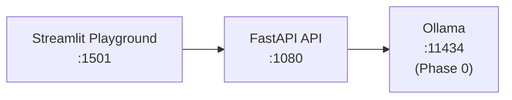

# GenAI Portfolio Suite – Phase 1: Ollama Multi-LLM Server

Multi-model inference API and playground powered by [Ollama](https://ollama.com).  
Serve, switch, compare, and benchmark 6 local LLMs through a unified FastAPI backend and Streamlit UI.

**Part of the [GenAI Portfolio Suite](https://github.com/adityonugrohoid).**  
> **Phase:** 1 – Local LLM Serving (multi-model API + playground)

---

## Table of Contents

- [Overview](#overview)
- [Quick Start](#quick-start)
- [Architecture](#architecture)
- [Features](#features)
- [Available Models](#available-models)
- [Requirements](#requirements)
- [API Reference](#api-reference)
- [Project Structure](#project-structure)
- [Tech Stack](#tech-stack)
- [Author](#author)
- [License](#license)

---

## Overview

`ollama-multi-llm-server` exposes a **multi-model inference API** and **Streamlit playground** on top of a shared Ollama runtime (Phase 0).

Use it to:
- Experiment with multiple local LLMs
- Compare responses and latency across models
- Provide a simple API layer for other tools and services

---

## Quick Start

### Prerequisites

- Docker and Docker Compose
- NVIDIA GPU + drivers (optional; CPU fallback works)
- **Phase 0:** [ollama-runtime](https://github.com/adityonugrohoid/ollama-runtime) running

### Start Services

```bash
# 1. Start Ollama (Phase 0)
cd ~/projects/ollama-runtime && ./scripts/start.sh

# 2. Start API + UI
cd ~/projects/ollama-multi-llm-server
./scripts/start.sh

# 3. Download models into Ollama
./scripts/pull_models.sh
```

### Service URLs

| Service | URL |
|---------|-----|
| API | http://localhost:1080 |
| API Docs (Swagger) | http://localhost:1080/docs |
| Playground UI | http://localhost:1501 |
| Ollama | http://localhost:11434 (Phase 0) |

---

## Architecture



Ollama runs as a shared service from **Phase 0: [ollama-runtime](https://github.com/adityonugrohoid/ollama-runtime)**.  
All phases connect via the `ollama-runtime-network` Docker network.

---

## Features

<table>
<tr>
<td align="center">

<br/><strong>Multi-LLM Playground</strong>
</td>
<td align="center">

<br/><strong>Model Comparison</strong>
</td>
</tr>
</table>

- **Multi-model switching** – hot-swap between 6 models via API
- **Model comparison** – send the same prompt to multiple models side-by-side
- **Tiered model selection** – fast / balanced / quality tiers for different use cases
- **Performance benchmarking** – automated speed and throughput comparison
- **Interactive playground** – Streamlit UI for experimentation
- **Ollama status** – live connection indicator in the sidebar

---

## Available Models

> **Default model across Phase 0-1-2:** `llama3.2:3b`

All models are 3B-class Q4_K_M quantized for consistent performance.

| Family    | Model         | Size   | Use Case                       |
|-----------|--------------|--------|--------------------------------|
| Meta      | `llama3.2:3b`  | 2.0 GB | **Default** -- general-purpose |
| Alibaba   | `qwen2.5:3b`   | 1.9 GB | Strong multilingual support    |
| Microsoft | `phi3.5:3.8b`  | 2.2 GB | Reasoning, code tasks          |

---

## Requirements

- Docker and Docker Compose
- NVIDIA GPU + drivers (optional; CPU fallback works)
- **Phase 0:** [ollama-runtime](https://github.com/adityonugrohoid/ollama-runtime) running

---

## API Reference

### Models

```bash
# List all models
curl http://localhost:1080/models/

# Get current model
curl http://localhost:1080/models/current

# Switch model
curl -X POST http://localhost:1080/models/switch \
  -H "Content-Type: application/json" \
  -d '{"model_id": "qwen2.5:3b"}'
```

### Inference

```bash
# Generate
curl -X POST http://localhost:1080/inference/generate \
  -H "Content-Type: application/json" \
  -d '{"prompt": "Explain Docker in one sentence", "max_tokens": 128}'

# Compare models
curl -X POST "http://localhost:1080/inference/compare?prompt=What+is+RAG&models=llama3.2:3b&models=qwen2.5:3b"
```

### Health

```bash
curl http://localhost:1080/health
```

See [docs/API.md](docs/API.md) for the full API reference.

### Benchmarking

```bash
# Benchmark all models
python3 scripts/benchmark.py

# Benchmark specific models
python3 scripts/benchmark.py --models llama3.2:3b qwen2.5:3b

# Save results to JSON
python3 scripts/benchmark.py --output results.json
```

### Testing

```bash
python3 -m venv .venv
source .venv/bin/activate
pip install -r requirements.txt
pytest tests/ -v
```

11 tests covering all API endpoints.

---

## Project Structure

```
ollama-multi-llm-server/
├── api/
│   ├── main.py                 FastAPI application entry point
│   ├── routes/
│   │   ├── inference.py        /inference/generate, /inference/compare
│   │   ├── models.py           /models, /models/switch, /models/current
│   │   └── health.py           /health
│   └── clients/
│       └── ollama_client.py    Ollama HTTP wrapper + model registry
├── ui/
│   └── app.py                  Streamlit playground (Generate + Compare)
├── scripts/
│   ├── start.sh                Launch API + UI (requires Phase 0)
│   ├── pull_models.sh          Download all 6 models
│   └── benchmark.py            Model speed comparison
├── tests/
│   ├── conftest.py
│   └── test_inference.py       11 endpoint tests
├── docs/
│   ├── images/                 Screenshots
│   ├── API.md
│   └── MODELS.md
├── docker-compose.yaml
├── requirements.txt
├── LICENSE
└── README.md
```

---

## Tech Stack

- **LLM Runtime:** Ollama (via Phase 0)
- **Backend:** FastAPI + Python 3.12
- **UI:** Streamlit
- **HTTP Client:** httpx (async)
- **Infrastructure:** Docker Compose

---

## Author

**Adityo Nugroho** – [github.com/adityonugrohoid](https://github.com/adityonugrohoid)

---

## License

MIT License – see [LICENSE](LICENSE).
